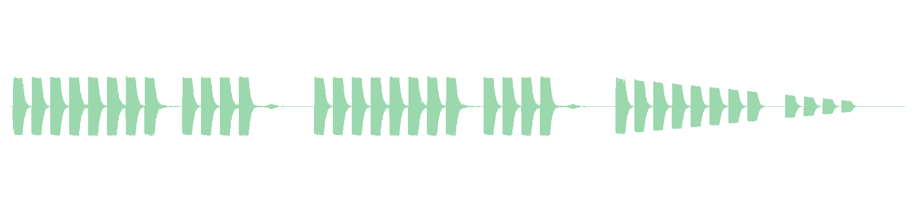
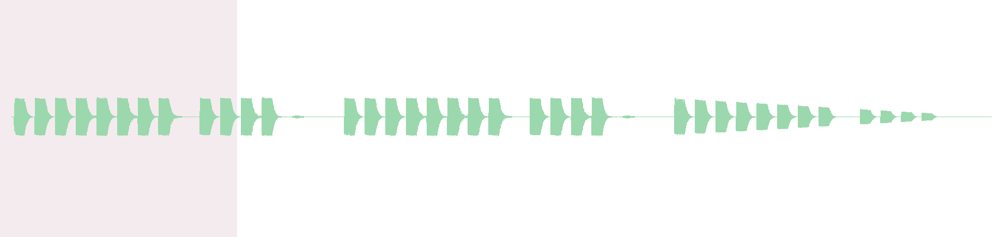
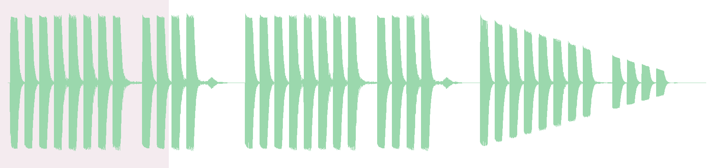

# sound-waveform-gen

Learning sound waveform and image generation concepts in golang. 

#### Usage ⛭:
---
#### Requirements:
`go1.23.5` (Go modules)

#### Running 🚀:
Clone to this repository to get a copy of the codebase. Change directory (`cd`) into the root directory of the repository.

To generate the images, run `go run main.go` file. The generate image can be found in the output folder. 

Try this out with various audio file (note, we only support `.wav` file). Happy Hacking.:)

##### Expected output:

Background and Opacity:

Zoomed image:

---

##### TODO:
- Support different audio file formats.
- Multiple image generation.
- Audio visualizer
